# Lista de Exercícios 02: variáveis e operadores lógicos/aritméticos 

Profº.: Cainã Antunes Silva  
Faculdade de Tecnologia **SENAI Sorocaba**  
Tecnólogo em Análise e Desenvolvimento de Sistemas (ADS)
___

> O objetivo desta aula é dominar a manipulação de variáveis e operadores lógicos e aritméticos exercitando o raciocínio lógico para a criação de algoritmos.  

Variáveis em linguagens de programação são espaços na memória que armazenam valores que podem ser manipulados durante a execução do programa, permitindo a criação de algoritmos dinâmicos e flexíveis. Operadores aritméticos, como soma (+), subtração (-), multiplicação (*) e divisão (/), realizam cálculos matemáticos essenciais para o processamento de dados. Já os operadores lógicos, como AND, OR e NOT, possibilitam a tomada de decisões ao avaliar expressões booleanas, controlando o fluxo do programa. A combinação desses elementos é fundamental para a construção de algoritmos eficientes e funcionais.

Para mais informações acesse [Aula 03: Fluxogramas.](https://cainaantunes.notion.site/Aula-03-Vari-veis-189bde521b3b8092a2dfdfef9190b15e?pvs=4)

***

1. Ler um número inteiro e exibir o seu dobro.

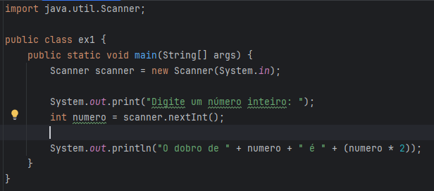

2. Ler um número inteiro e exibir o seu quadrado.

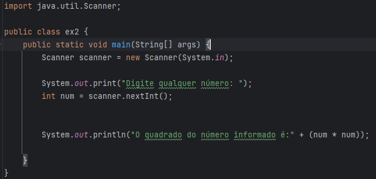

3. Ler um número real e exibir a quinta parte deste número.

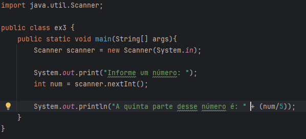

4. Ler duas notas N1 e N2 e exibir a média.

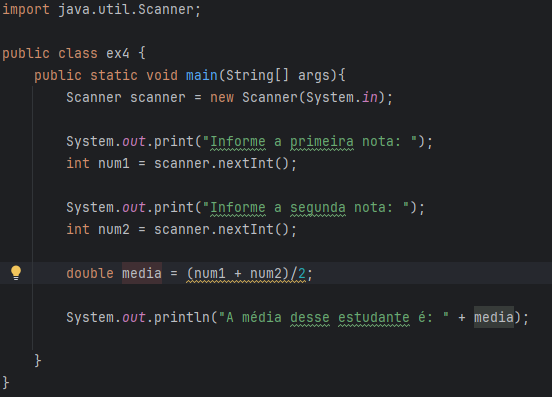

5. Ler uma velocidade em $Km/h$ e converter para $m/s$.

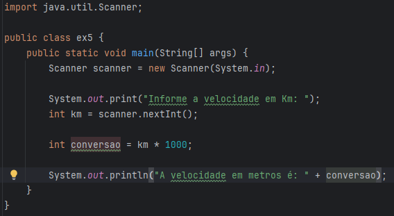

6. Ler uma velocidade em $m/s$ e converter para $km/h$.

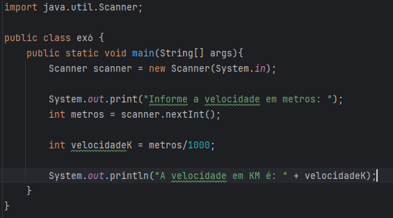

7. Ler uma medida em milímetro e converter para polegadas.

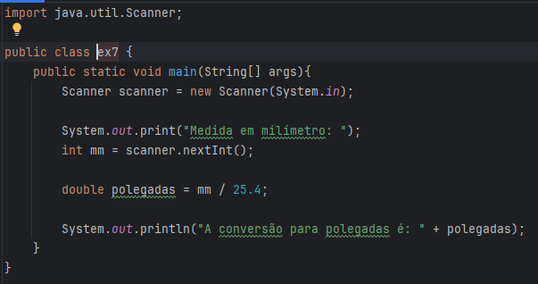

8. Ler uma medida em polegadas e converter para milímetros.

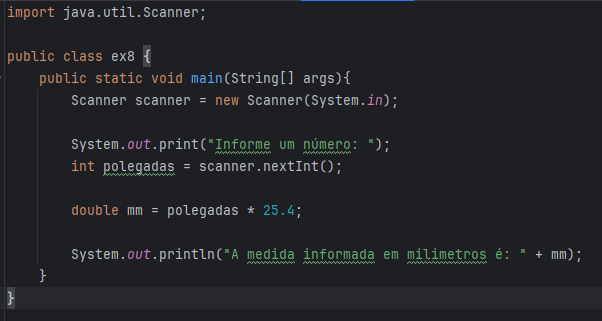

9. Ler uma medida de distância em quilômetros e converter 
para milhas.

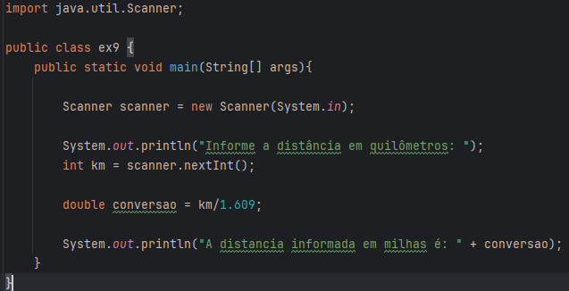

10. Ler uma medida de distância em milhas e converter para quilômetros.

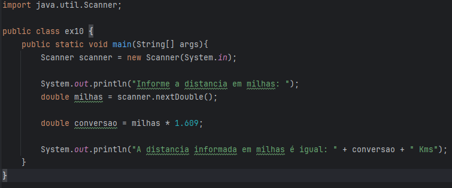

11. Entrar com o valor de temperatura em graus Celsius e exibir a temperaturacorrespondente em graus Fahrenheit.

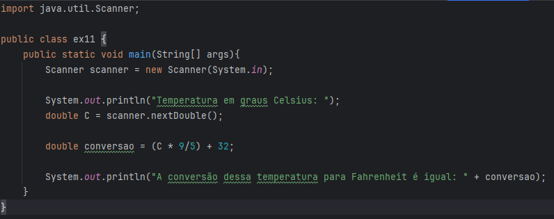

12. Ler duas notas N1 e N2 e exibir a média. 

      >Obs.: N1 tem peso 1 e N2 tem peso 2 e resultadodeve estar entre 0 e 10.

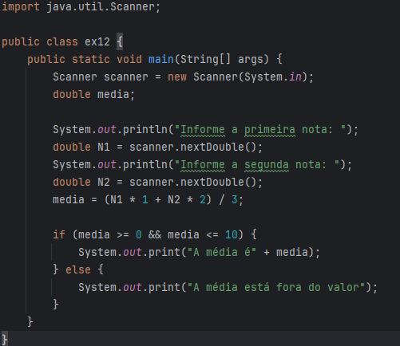

13. Receber o raio e um círculo e calcular sua área.

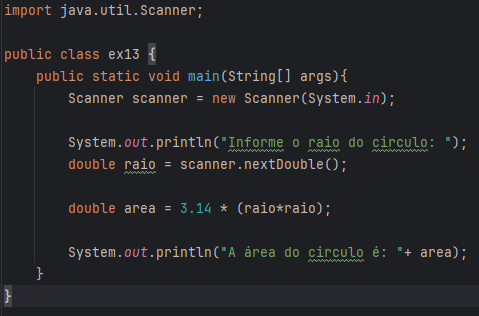

14. Receber a base e a altura de um triângulo retângulo e calcular sua área.

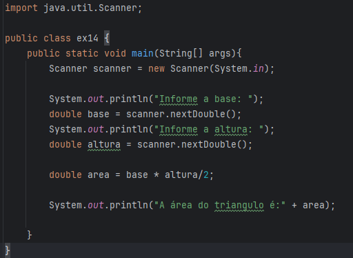

15. Receber o raio e a altura de um cilindro e calcular seu volume.

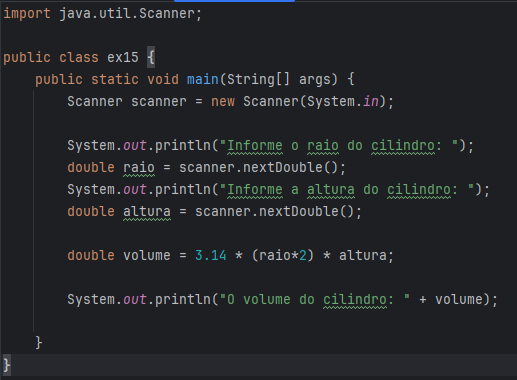

16. Receber o raio e a altura de um cone e calcular seu volume.

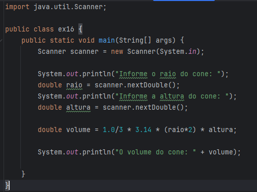

17. Receber velocidade inicial, aceleração e tempo de percurso de um corpo e calcular sua velocidade.

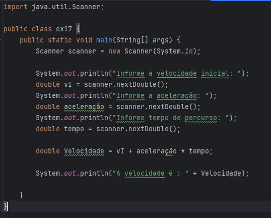

18. Receber os coeficientes $a$ e $b$ de uma equação do primeiro grau e imprimir a solução.

      >Equação do primeiro grau: $ax + b = 0$

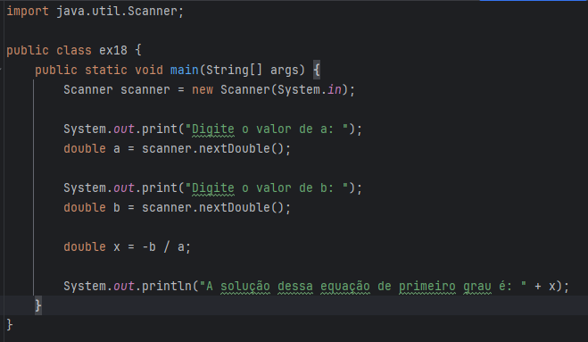

19. Receber os coeficientes $a$, $b$ e $c$ de uma equação do segundo grau e imprimir a solução.

      >Equação do segundo grau: $ax^2 + bx + c = 0$
      

20. Descobrir uma equação do segundo grau a partir de suas raízes:

      >Exemplo:  
      $x1 = 1$ e $x2 = 2$  
      Então:  
      $(x -1) . (x -2)$  
      Logo:  
      $x2 -3x -2 = 0$ 

      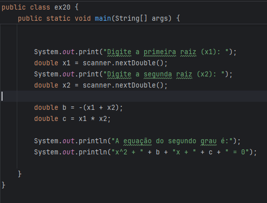